# 연경당 HR

> 직원 10명 규모 한식 외식 브랜드의 근태 관리를 위해 만든 사내 PWA.
> GPS 기반 출퇴근, 스케줄 캘린더, 관리자 대시보드까지 — 실제 매장에서 매일 사용 중입니다.
>
> **개발 기간: 2주** (2026.03.16 ~ 03.30)

<br/>

## 스크린샷

### 직원용 (모바일)

<p>
  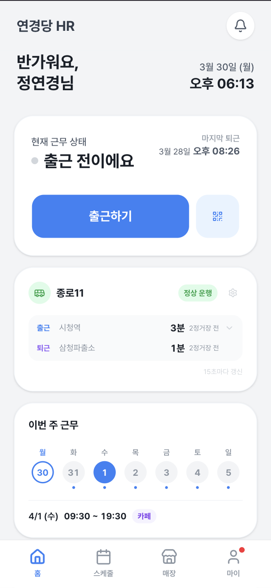
  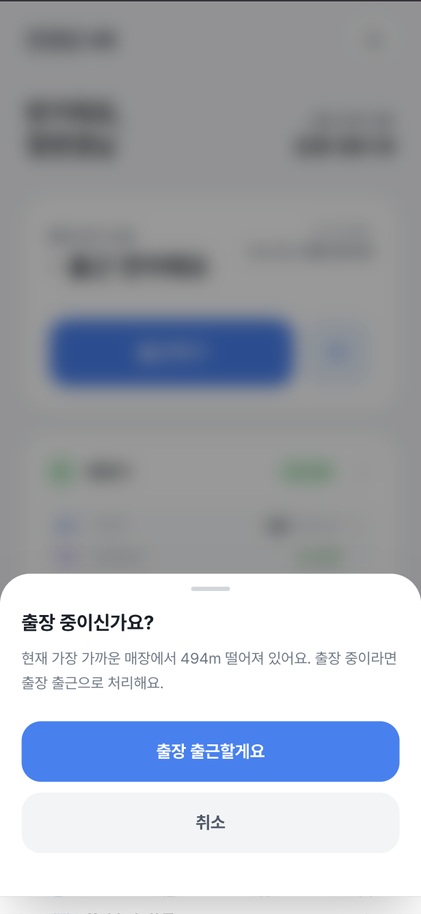
  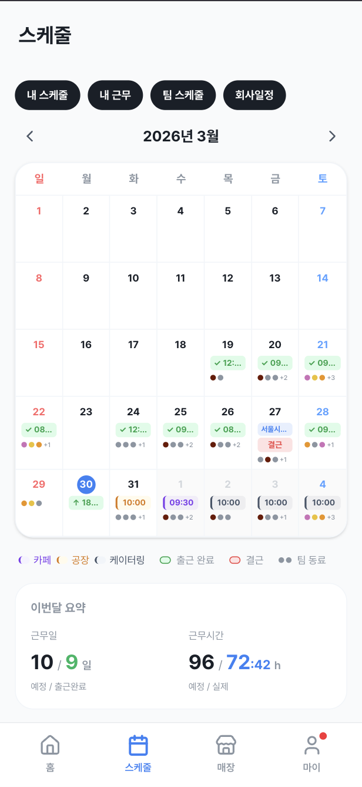
  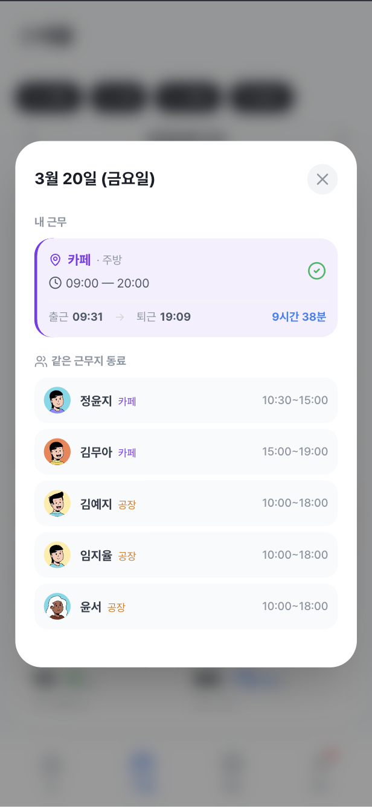
</p>
<p>
  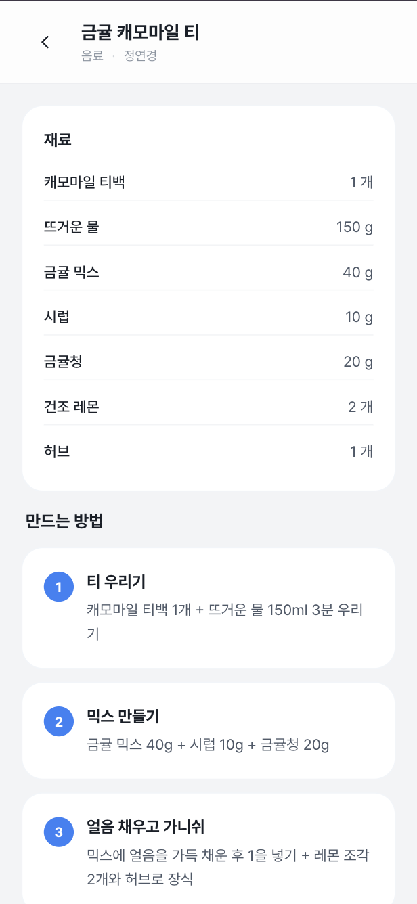
  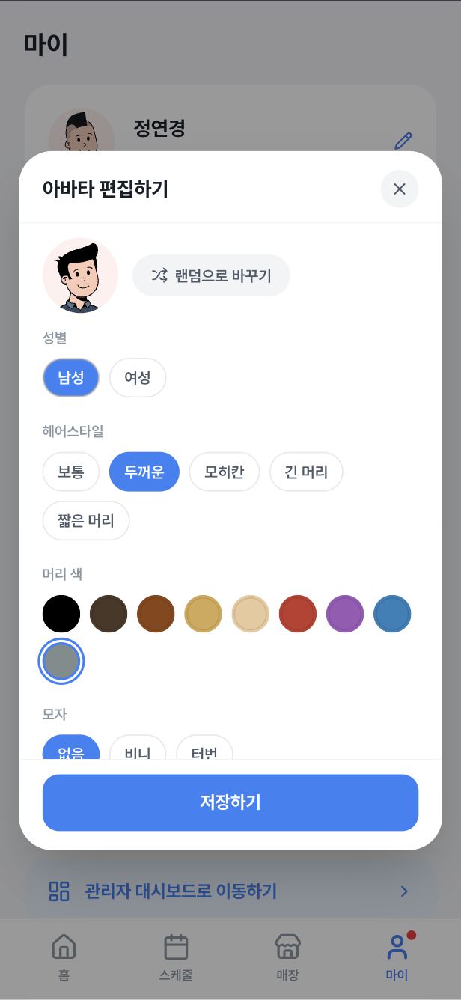
  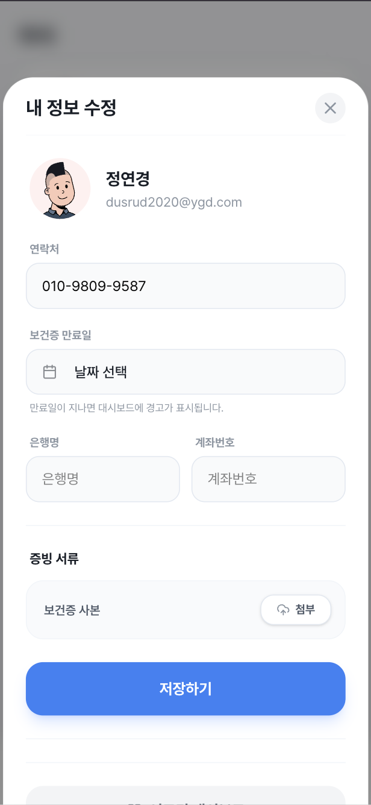
  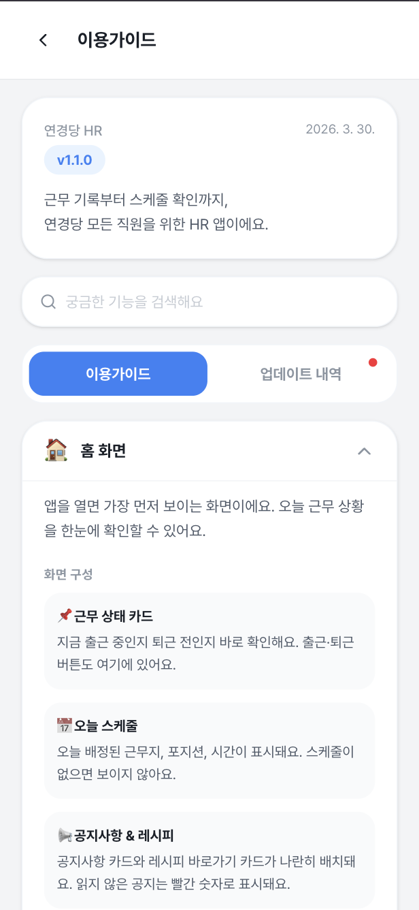
</p>

### 관리자용 (데스크톱)

<p>
  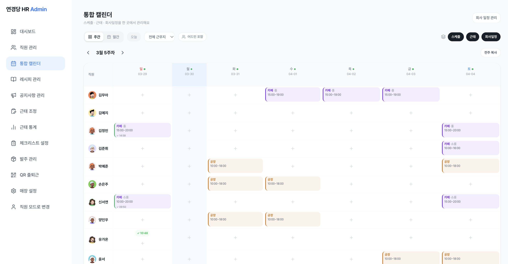
</p>
<p>
  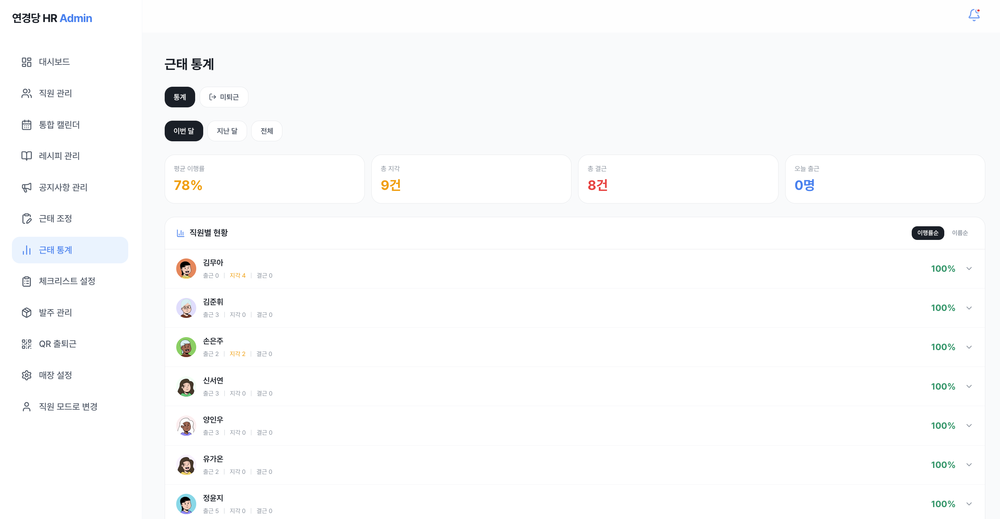
</p>
<p>
  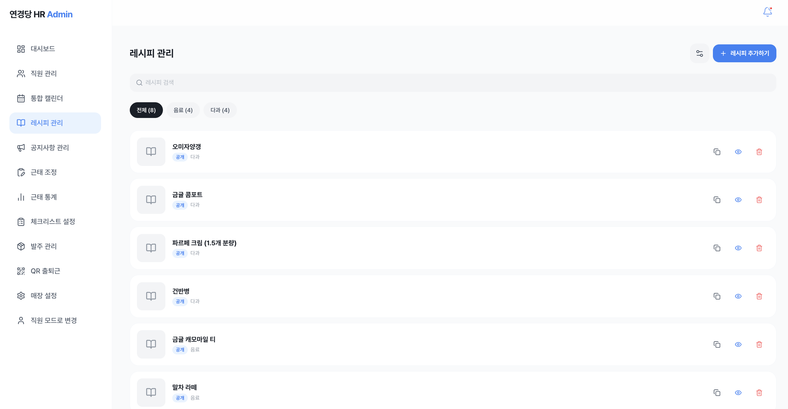
</p>
<p>
  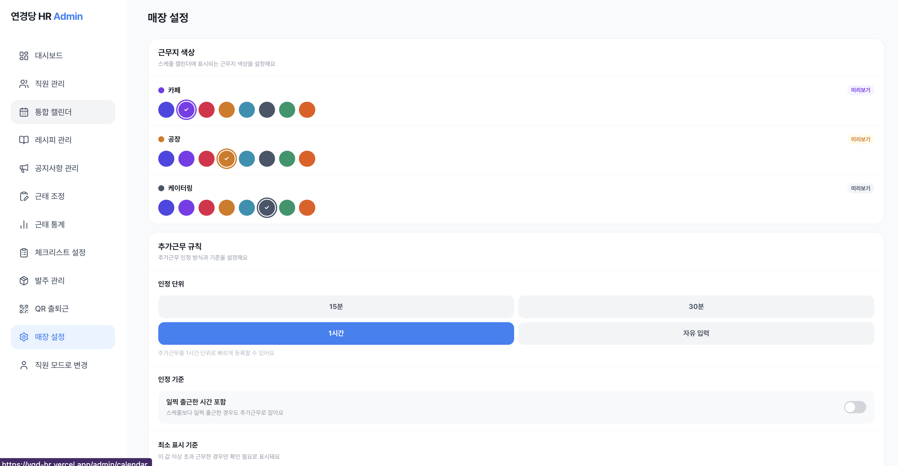
</p>

<br/>

## 주요 기능

### 출퇴근

- GPS 기반 자동 매장 감지 (반경 100m)
- 출장 출근 / 원격 퇴근 모드
- QR 코드 체크인
- 60초 이내 중복 타이밍 방지
- 근태 조정 요청 (지각, 조퇴, 미체크 자동 감지 → 사유 제출 → 관리자 승인)

### 스케줄 & 캘린더

- 내 스케줄 / 근무 기록 / 팀 스케줄 / 회사 일정 레이어 토글
- 월간 근무일수, 총 근무시간 자동 집계
- 대타 요청 → 승인 → 수락 워크플로우

### 관리자 대시보드

- 통합 캘린더 (전 직원 주간 스케줄 한눈에)
- 근태 통계 (출근율, 지각, 초과근무)
- 매장별 컬러 코딩, 인정 단위, 최소 표시 기준 설정
- 레시피 관리, 공지사항, 체크리스트 설정

### 기타

- 푸시 알림 (출퇴근 리마인더, 대타, 공지)
- 종로11번 버스 실시간 도착 정보
- 교통 통제 자동 알림
- 인앱 이용가이드 & 업데이트 내역

<br/>

## 기술 스택

| 영역 | 기술 |
|------|------|
| Framework | Next.js 16 (App Router) |
| Language | TypeScript |
| UI | React 19 + Tailwind CSS v4 + shadcn/ui |
| Backend | Supabase (Auth, PostgreSQL, RLS, Realtime) |
| Data Fetching | SWR |
| PWA | Serwist (Service Worker, Offline, Push) |
| Deployment | Vercel |
| Font | Pretendard |

<br/>

## 아키텍처

```
[모바일 PWA]          [관리자 웹]
     │                    │
     └──── Next.js App Router ────┘
                  │
            Supabase (BaaS)
           ┌──────┼──────┐
         Auth   Postgres  Storage
                  │
              RLS 정책
         (행 단위 접근 제어)
```

- **인증**: Supabase Auth (SSR 쿠키 기반 세션)
- **권한**: 모든 테이블 RLS 활성화, `is_admin()` 함수로 관리자 권한 분기
- **실시간**: Supabase Realtime으로 알림 구독
- **PWA**: Serwist 기반 Service Worker — 오프라인 캐싱, Web Push 알림
- **위치**: Geolocation API + Haversine 거리 계산으로 매장 자동 감지
